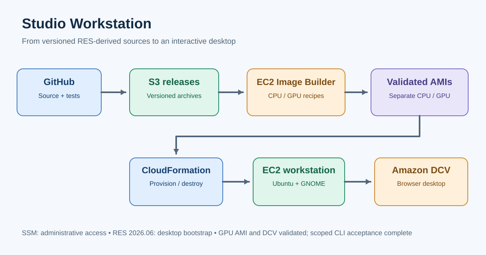
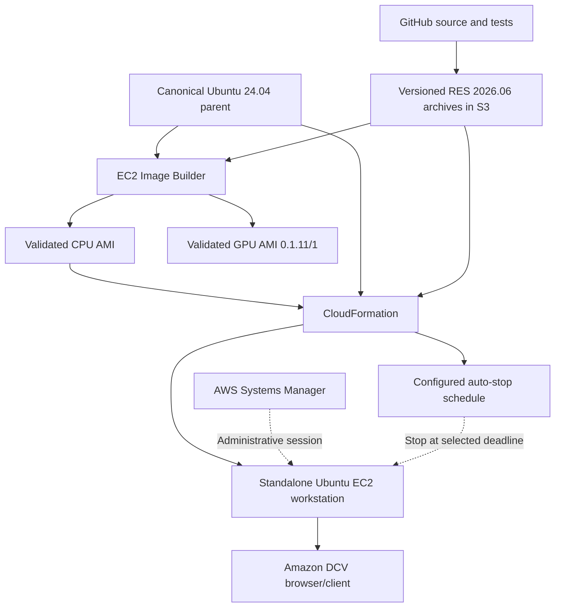

# Studio Workstation — architecture

The image records earlier image-build work. Workstation operation is separate:
the Studio CLI renders a RES-derived CloudFormation template and launches a named
EC2 instance. Current GPU launches use the Canonical base with the pinned RES
runtime installer; the lifecycle includes automatic stop and explicit destruction.

## Provisioning relationships

```mermaid
flowchart TD
  Repo["GitHub source and tests"] --> Release["Versioned RES 2026.06 archives in S3"]
  Ubuntu["Canonical Ubuntu 24.04 parent"] --> Builder["EC2 Image Builder"]
  Release --> Builder
  Builder --> CPU["Validated CPU AMI"]
  Builder --> GPU["Validated GPU AMI 0.1.11/1"]
  CPU --> CFN["CloudFormation"]
  Ubuntu --> CFN
  Release --> CFN
  CFN --> EC2["Standalone Ubuntu EC2 workstation"]
  EC2 --> DCV["Amazon DCV browser/client"]
  SSM["AWS Systems Manager"] -. "Administrative session" .-> EC2
  CFN --> Scheduler["Configured auto-stop schedule"]
  Scheduler -. "Stop at selected deadline" .-> EC2
```

The GPU AMI `ami-027c98f85b155c2ac` passed Image Builder 0.1.11/1, but its **Image Builder pipeline remains disabled and points to 0.1.10**. A successful manual image build does not imply the pipeline was upgraded. The runtime downloads separate version-pinned installer and application archives after launch.

## Trust and ownership boundaries

- GitHub stores source and tests, not passwords, private keys or proprietary NVIDIA binaries.
- The live EC2 uses `StudioWorkstationSSMRole` for SSM and exact-version RES S3 access; Image Builder has its own permissions.
- DCV authenticates the local Linux `workstation` user, **not AWS IAM**. A unique password is enrolled interactively through SSM.
- Each timed workstation has a tag-conditioned Scheduler role permitted to stop its
  instance. Ordinary expiration cannot delete the stack or terminate the instance.
- Public TCP 8443 may be explicitly enabled for access from changing networks; this is internet exposure, not identity-aware private networking. No inbound SSH. Trusted TLS and broader production access remain deferred.
- Manual stop and expiration keep the stack and saved EBS files. Start rearms
  a verified timer and may change the public IP. Explicit `destroy --delete-stack`
  deletes the local resources and owned timer, with absence checks.

See [Studio CLI](studio-cli.md), [lifecycle](workstation-lifecycle-visual.md), [GPU profile](gpu-workstation-profile.md), and [index](INDEX.md).
